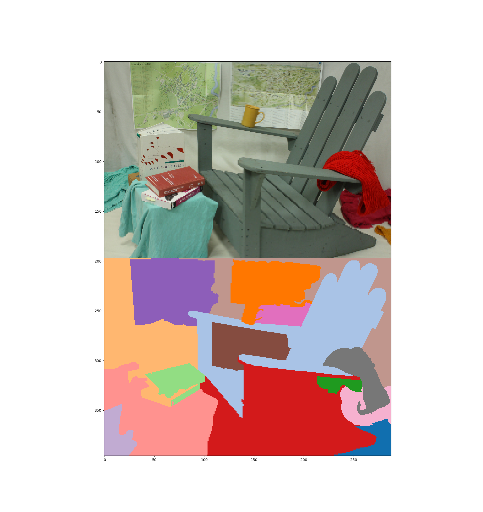

# Unsupervised Segmentatio through Agglomerative Clustering

This project is an unsupervised segmentation approach that augments the process via interactivity and depth.

Future Features:
	-  Can blur first before RGBFilter
	-  Can add just pure gradient over whole image X and Y to promote globs
	-  Add option for normalizing color per channel
